<div align="center"> 
 
# 👋 Hey there, I'm Divyanshu Maurya!

### 🔐 Cybersecurity Enthusiast | ⚙️ DevOps Engineer | 💻 Full Stack Developer |  🎨 Designer

[](https://git.io/typing-svg)  

[](https://www.linkedin.com/in/divyanshu-maurya-b5278b309/)
[](https://www.instagram.com/_divy1436_)
[](https://tryhackme.com/p/4136500)
[](https://github.com/divy1436)


</div>

---

## 🎓 About Me

```yaml
name: Divyanshu Maurya
role: DevOps Engineer | Security Researcher | Full Stack Developer
location: Jaipur, Rajasthan, India
education: B.Tech in Computer Science & Engineering (2nd Year)
college: Poornima College of Engineering
```

### 🚀 What I Do

**DevOps Enthusiast** passionate about automating infrastructure, building CI/CD pipelines, and optimizing deployment workflows. I specialize in Jenkins, GitLab CI/CD, Docker, and Kubernetes for seamless software delivery.

**Security Researcher** with hands-on experience in penetration testing, vulnerability assessment, and ethical hacking. Active on TryHackMe, constantly sharpening my offensive security skills.

**Full Stack Developer** creating responsive web applications with modern technologies. I combine development expertise with DevOps practices to build scalable, secure systems.

**Creative Designer** skilled in graphic design, video editing, and social media management—bringing technical and creative skills together.

### 🎯 Leadership & Community

- 👑 **Captain & Founder** - Cybersecurity Club
- 🏅 **Former Vice Captain** - Campus Activities

### 💡 Current Mission

Building production-grade DevOps pipelines and implementing DevSecOps practices to bridge the gap between development, operations, and security. Always learning, always automating, always securing.

---

## 🚀 Currently Exploring & Learning

<table>
<tr>
<td width="50%" valign="top">

### ⚙️ DevOps & CI/CD
- 🔧 **Jenkins** - Building automated CI/CD pipelines
- 🦊 **GitLab CI/CD** - Repository management & automation
- 📦 **Maven** - Java build automation & dependency management
- 🐳 **Docker** - Container orchestration & microservices
- ☸️ **Kubernetes** - Container orchestration (Learning)
- 🌐 **Nginx** - Web server, reverse proxy & load balancing
- 🍅 **Tomcat** - Java servlet container & app deployment

</td>
<td width="50%" valign="top">

### ☁️ Cloud & Infrastructure
- ☁️ **AWS** - EC2, S3, Lambda, RDS
- 🐧 **Linux Administration** - Ubuntu, CentOS, RHEL
- 🔐 **Security Hardening** - Server & network security
- 🌐 **Networking** - TCP/IP, DNS, Load Balancing

### 🔐 Cybersecurity
- 🎯 **Penetration Testing** - Web & network pentesting
- 🛡️ **Security Operations** - Threat detection & response
- 🔍 **Vulnerability Assessment** - OWASP, CVE analysis
- 🖥️ **TryHackMe Labs** - Practical hacking challenges
- 🔒 **Secure DevOps (DevSecOps)** - Security in pipelines

</td>
</tr>
</table>

---

## 💻 Tech Stack & Tools

<div align="center">

### 👨‍💻 Programming Languages


### 🌐 Frontend Development


### ⚙️ DevOps & CI/CD Tools


### 🌐 Web Servers & Application Servers


### ☁️ Cloud Platforms


### 📊 Monitoring & Observability


### 🔧 Version Control & Collaboration


### 🐧 Operating Systems & Tools


### 🔐 Security & Testing Tools


### 🎨 Creative & Design Tools


</div>

---

## 🎯 DevOps Pipeline Architecture

```mermaid
graph LR
    A[👨‍💻 Developer] -->|Push Code| B[📦 GitLab/GitHub]
    B -->|Webhook| C[🔧 Jenkins/GitLab CI]
    C -->|Build| D[📦 Maven/Gradle]
    D -->|Test| E[✅ JUnit/Selenium]
    E -->|Package| F[🐳 Docker Image]
    F -->|Push| G[📦 Docker Registry]
    G -->|Deploy| H[☸️ Kubernetes/Tomcat]
    H -->|Serve| I[🌐 Nginx]
    I -->|Monitor| J[📊 Prometheus/Grafana]
    J -->|Alert| K[🚨 Ops Team]
```

<div align="center">



</div>

---

## 📚 DevOps Learning Journey

<details>
<summary><b>🔧 Jenkins - CI/CD Automation</b></summary>

### What I'm Learning:
- Setting up Jenkins master-slave architecture
- Creating declarative and scripted pipelines
- Integrating Jenkins with GitLab/GitHub webhooks
- Automating builds with Maven and Gradle
- Implementing Blue Ocean for better visualization
- Securing Jenkins with role-based access control
- Plugin management and custom pipeline libraries

### Sample Projects:
- Java application CI/CD with Maven + Jenkins + Tomcat
- Automated testing and deployment pipelines
- Multi-branch pipeline configurations

</details>

<details>
<summary><b>🦊 GitLab - DevOps Platform</b></summary>

### What I'm Learning:
- GitLab CI/CD pipeline configuration (.gitlab-ci.yml)
- GitLab runners (shared, group, and specific)
- Container registry integration
- Merge request workflows and code reviews
- GitLab Pages for documentation
- Security scanning and dependency checking
- Auto DevOps features

### Key Features Explored:
- Branch protection and approval rules
- CI/CD variables and environments
- Pipeline scheduling and triggers

</details>

<details>
<summary><b>📦 Maven - Build Automation</b></summary>

### What I'm Learning:
- Project Object Model (POM) configuration
- Dependency management and repositories
- Build lifecycle phases (compile, test, package, install, deploy)
- Multi-module project structures
- Plugin configuration and custom goals
- Integration with Jenkins for automated builds
- Artifact management with Nexus/Artifactory

</details>

<details>
<summary><b>🌐 Nginx - High Performance Web Server</b></summary>

### What I'm Learning:
- Nginx configuration and virtual hosts
- Reverse proxy setup for backend services
- Load balancing algorithms (round-robin, least-conn, ip-hash)
- SSL/TLS certificate configuration
- Caching strategies and optimization
- Rate limiting and security headers
- Integration with Docker and Kubernetes

### Use Cases:
- Frontend application serving
- API gateway and microservices routing
- Static content delivery and caching

</details>

<details>
<summary><b>🍅 Apache Tomcat - Java Application Server</b></summary>

### What I'm Learning:
- Tomcat installation and configuration
- Deploying WAR files and web applications
- Server.xml and context.xml configuration
- Connector configuration (HTTP, AJP)
- Memory tuning and performance optimization
- Integration with Jenkins for automated deployment
- Tomcat clustering and session replication
- Security realm configuration and JDBC authentication

### Deployment Workflows:
- Jenkins → Maven Build → Tomcat Deployment
- Docker containerized Tomcat applications
- Nginx + Tomcat architecture

</details>

---

## 📊 GitHub Analytics

<div align="center">


</div>

---

## 🏆 GitHub Trophies

<div align="center">


</div>

---

## 🧠 TryHackMe Progress

<div align="center">


**🔗 [Visit My TryHackMe Profile](https://tryhackme.com/p/4136500)**

**Practicing offensive security and defensive strategies through hands-on labs**

</div>

---

## 📈 GitHub Activity Graph

<div align="center">


</div>

---

## 💡 Featured Projects

<div align="center">

### 🚀 DevOps Portfolio Projects (In Development)

| Project | Tech Stack | Status |
|---------|-----------|--------|
| 🔧 **Jenkins CI/CD Pipeline** | Jenkins + Maven + Tomcat | 🟡 In Progress |
| 🦊 **GitLab Auto DevOps** | GitLab CI + Docker + K8s | 🟡 In Progress |
| 🐳 **Dockerized Microservices** | Docker + Nginx + Node.js | 🟡 In Progress |
| ☸️ **Kubernetes Cluster** | K8s + Helm + Prometheus | 🔴 Planning |
| 📜 **Infrastructure as Code** | Terraform + Ansible | 🔴 Planning |

*Repository links will be added soon!*

</div>

---

## 💭 Random Dev Quote

<div align="center">


</div>

---

## 📫 Let's Connect & Collaborate!

<div align="center">

### 🤝 Open For

<table>
<tr>
<td align="center">💼</td>
<td>DevOps Internships & Opportunities</td>
</tr>
<tr>
<td align="center">🔐</td>
<td>Cybersecurity Research & Bug Bounties</td>
</tr>
<tr>
<td align="center">🚀</td>
<td>Open Source Contributions</td>
</tr>
<tr>
<td align="center">💡</td>
<td>Tech Discussions & Knowledge Sharing</td>
</tr>
<tr>
<td align="center">🤝</td>
<td>Collaboration on DevOps Projects</td>
</tr>
</table>

</div>

---

<div align="center">

## 🌐 Connect With Me

[](https://www.linkedin.com/in/divyanshu-maurya-b5278b309/)
[](https://www.instagram.com/_divy1436_)
[](https://github.com/divy1436)
[](https://tryhackme.com/p/4136500)

</div>

---

<div align="center">

### 💡 "Automate Everything. Secure Everything. Monitor Everything."

### 🔥 Current Focus
**Building production-grade DevOps pipelines with Jenkins, GitLab, Docker, and Kubernetes**

---

### ⭐ If you find my work interesting, consider starring my repositories!

### 📧 Feel free to reach out for collaborations or just a tech chat!

---

**Thanks for visiting my profile! Have a great day! 🚀**

</div>
